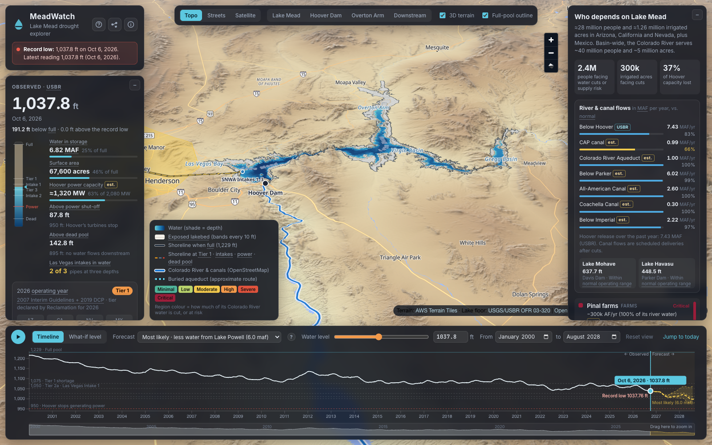
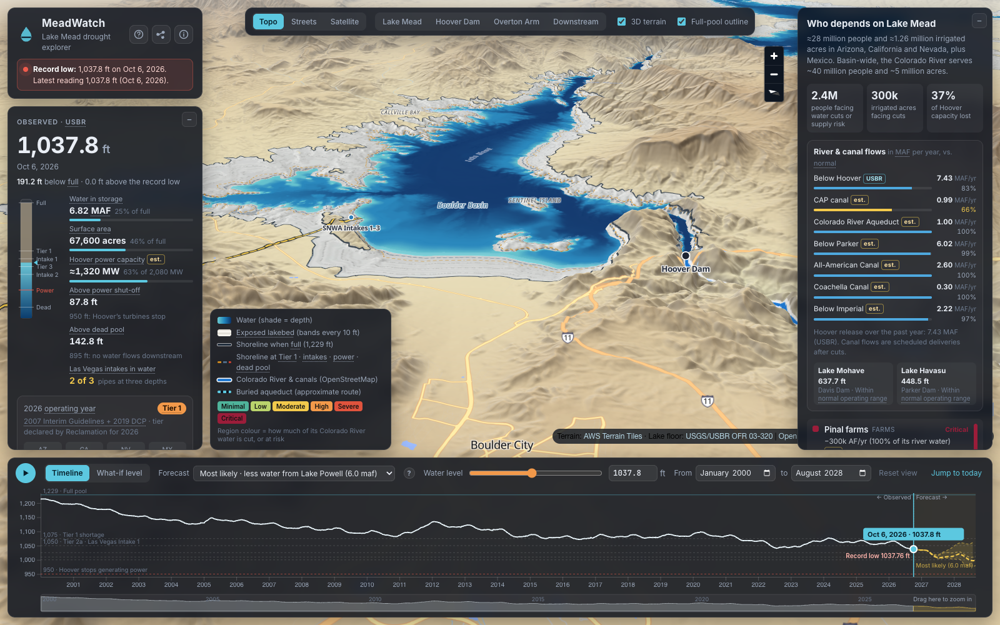
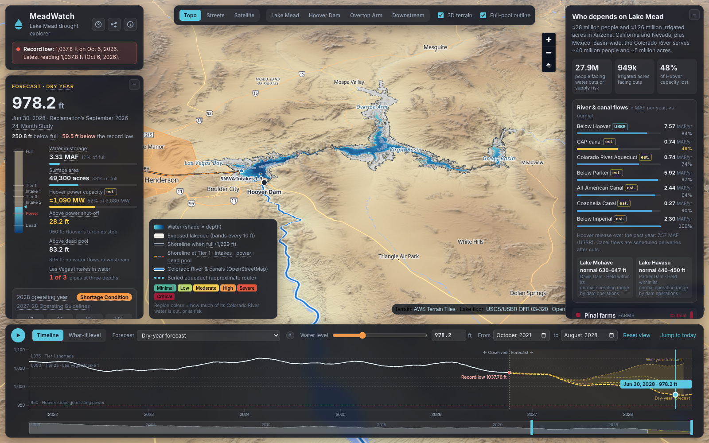
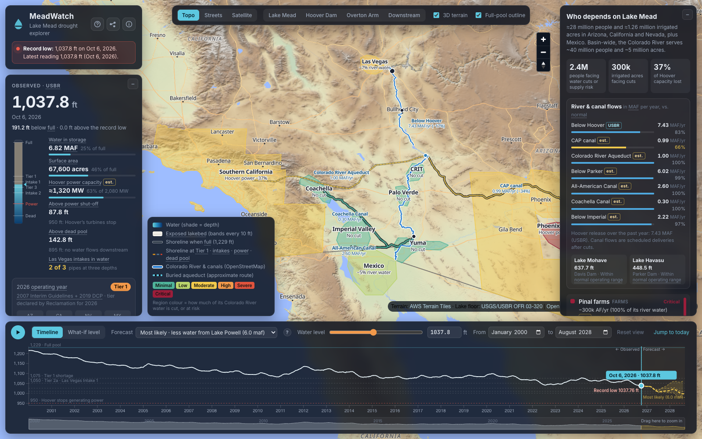

# MeadWatch

**See Lake Mead's record low in 3D, and who downstream runs short.**

[**mead.watch**](https://mead.watch/)



In fall 2026 Lake Mead fell below every level on record, reaching **1,037.76 ft** on October 6, 2026, its lowest since it first filled in the 1930s. (The live reading, refreshed daily, is on [mead.watch](https://mead.watch/).) MeadWatch shows what that means. You can drain the reservoir on its real lake floor, follow its decline since 2000 into Reclamation's forecasts, and see how each foot changes water and power for the ~28 million people and ~1.3 million irrigated acres in Arizona, California, Nevada and Mexico that depend on it.

## Features

- **The real lake floor in 3D.** Inside the reservoir, the terrain is the USGS/Reclamation lake-floor survey, so falling water exposes the actual drowned canyons. Dry lakebed shows as a white "bathtub ring", banded every 10 ft. Shorelines are marked at Tier 1, both Las Vegas intakes, minimum power pool and dead pool.
- **Any water level.** Scrub the timeline from 2000 to 2028, play it, or set a hypothetical level from 870 to 1,229 ft. Zoom into any period by dragging on the strip under the chart or typing a From and To month, and reset with one click. The water surface, shoreline and every figure update together.
- **Key numbers at a glance:**
  - elevation, storage and surface area
  - Hoover Dam generating capacity
  - distance to minimum power pool and to dead pool
  - which Las Vegas intakes still reach water
  - the shortage tier and each state's scheduled cut
- **Who is affected.** Ten downstream regions are coloured by how hard they're hit at the current level, from Las Vegas and Phoenix to Imperial Valley and Mexico. Each comes with population, farmland and an explanation.
- **Rivers and canals.** The Colorado River below Hoover Dam and the CAP, Colorado River Aqueduct, All-American and Coachella canals are traced on OpenStreetMap. Line widths follow their flow, beside live levels for Lakes Mohave and Havasu, until dead pool leaves them dry.
- **Official forecasts.** These are Reclamation's September 2026 24-Month Study runs:
  - probable minimum
  - two most-probable runs (6.0 and 7.0 MAF released from Lake Powell)
  - probable maximum
- **Two rule sets.** Years through 2026 use the 2007 Interim Guidelines and Drought Contingency Plan, with the tier Reclamation actually declared. 2027–28 uses the new Operating Guidelines, and what-if mode can compare the two.
- **Plain language.** Every technical term is underlined and explains itself on hover or tap. A built-in guide covers how to use the map, and a searchable glossary of more than 40 terms runs from acre-feet to senior water rights.
- **Share and embed.** Every view has its own link. An embed code puts a compact version on any page, and the methods page lists every source.

| Hoover Dam & Boulder Basin | Dry forecast, mid-2028 | Who's downstream |
|---|---|---|
|  |  |  |

## How it works

**Lake floor and water.** The 30 m USGS lake-floor grid is resampled onto the map's tile grid. Each cell gets a *spill elevation*: the lowest lake level at which water reaches it from Hoover Dam, so basins cut off by a sill stay dry. A WebGL layer draws a flat water surface at the chosen level over the cells below it, shaded by depth. Storage and surface area come from the same grid, which reproduces Reclamation's reported storage to within 0.4%.

**Impacts.** The published shortage schedules set each state's cut. Splitting a state's cut among its users is MeadWatch's own approximation, marked *est.* in the app. Hoover's capacity is estimated from the head of water behind the dam. Physical limits apply on top of policy: limited releases below 950 ft, none at dead pool (895 ft), and no Las Vegas pumping below 875 ft.

**Forecasts.** Reclamation published September 2026's Most Probable runs only as a chart, so MeadWatch reads them from it. The reading reproduces the published minimum and maximum tables to within 0.3 ft.

## Data

| Data | Source | Updated |
|---|---|---|
| Lake Mead, Mohave and Havasu levels, storage, Hoover releases | U.S. Bureau of Reclamation hydrodata | Daily |
| Forecasts | Reclamation 24-Month Study | Monthly |
| Lake floor | USGS/USBR Open-File Report 03-320 (2001 survey) | Static |
| Operating rules | 2007 Interim Guidelines, 2019 DCP, IBWC Minute 323, 2027–28 Operating Guidelines | As adopted |
| Rivers, canals, basemap | © OpenStreetMap contributors via OpenFreeMap | Continuous |
| Terrain · imagery | AWS Open Data Terrain Tiles · Sentinel-2 cloudless 2016 by EOX (CC BY 4.0) | Static |
| Service areas | US Census county boundaries | Static |

## Limitations

- Allocations within a state, canal flows and Hoover capacity are estimates. They're labelled *est.* in the app.
- Irrigation districts and the buried Colorado River Aqueduct route are approximate, and Mexico's 2027–28 terms (IBWC Minute 334) are not modelled.
- The lake-floor survey ends at 114°W, so the narrow Lower Granite Gorge reach is not modelled.

## Development

```bash
npm install
npm run dev      # local server at http://localhost:5173
npm run build    # production build in dist/
npm test         # browser smoke test against a running server (needs: npx playwright install chromium)
```

| Folder | Contents |
|---|---|
| `src/` | The app (TypeScript): map, water layer, timeline, impact model, glossary |
| `public/data/` | Prepared data the app loads |
| `scripts/` | Data pipeline: `npm run data:levels` (daily USBR readings), `data:forecast`, `data:bathymetry`, `data:waterways`, `data:regions`, `og` (preview image), `screenshots` (these README images). The Python steps need `pip install -r scripts/requirements.txt` |
| `tests/` | `smoke.mjs`: end-to-end checks in headless Chromium, with screenshots |

The site deploys to GitHub Pages from `main` and refreshes Reclamation's daily readings automatically. Built with MapLibre GL JS, d3 and Vite.

---

MeadWatch is an independent project. It is not affiliated with, or endorsed by, the U.S. Bureau of Reclamation, USGS or any water agency.
